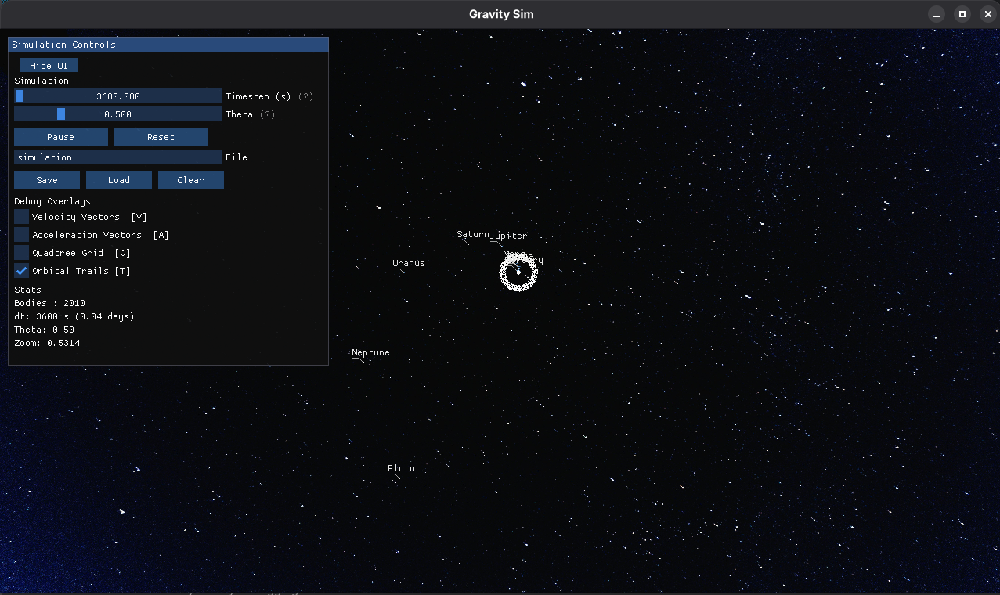
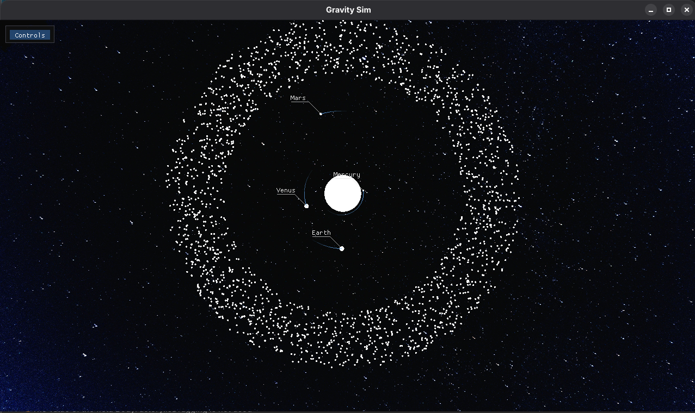
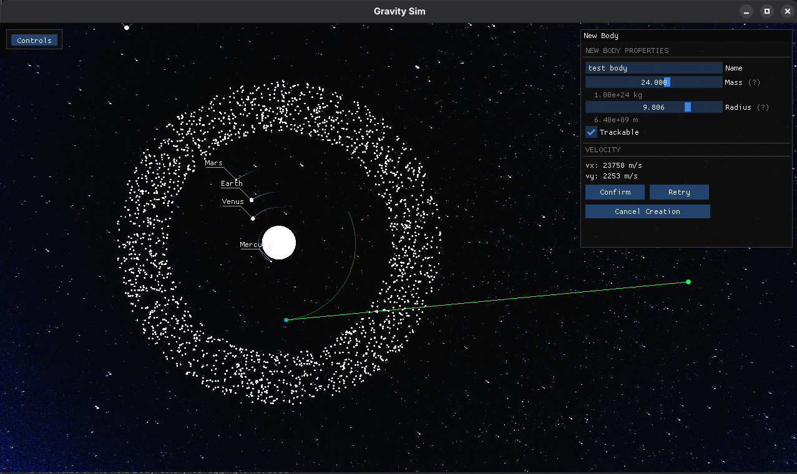

# N-Body Gravitational Simulation

A real-time gravitational simulation of the solar system built in Java using OpenGL for rendering. Simulates gravitational interactions between hundreds of bodies including planets and an asteroid belt, optimized using the Barnes-Hut algorithm for near-linear performance scaling.





---

## Features

- Real-time N-body gravitational simulation with accurate Newtonian physics
- Barnes-Hut quadtree optimization reducing force calculations from O(n²) to O(n log n)
- Leapfrog integration for long-term orbital stability and energy conservation
- Full solar system with 9 planets (Justice for Pluto!) and a 2000-body asteroid belt
- OpenGL rendering via LWJGL with right-click pan, zoom-to-cursor, and scroll zoom
- ImGui runtime control panel with timestep and theta sliders, pause, reset, and save/load
- Body creation during a live simulation - place a body with left click, configure mass and radius, set initial velocity by dragging, and preview a projected orbit before confirming
- Orbital trail rendering for trackable bodies with alpha-faded position history
- Projected orbit preview for newly created bodies using the most massive body as the gravitational attractor
- Tracking indicators with leader lines and name labels for trackable bodies when zoomed out past a configurable pixel threshold
- Save and load simulation states as human-readable JSON files
- Space background image rendered behind the simulation
- Per-body naming, trackable flag, mass, and radius configurable at creation time
- Debug overlays for velocity vectors, acceleration vectors, and quadtree grid visualization
- File explorer for saving and loading using TinyFD 

---

## Planned Features

- Texturing of bodies dynamically

---

## Physics

### Newtonian Gravity

Every body in the simulation exerts a gravitational force on every other body according to Newton's law of universal gravitation:

```
F = G x m1 x m2 / r^2
```

Where `G` is the gravitational constant (6.674 x 10^-11 N m^2/kg^2), `m1` and `m2` are the masses of the two bodies, and `r` is the distance between them. From this force, each body's acceleration is derived via Newton's second law (`F = ma`), which is then used to update velocity and position each timestep.

### Softening

When two bodies pass very close together, `r` approaches zero and the force approaches infinity, which would destabilize the simulation. A softening factor `e` is added to the denominator to prevent this:

```
F = G x m1 x m2 / (r^2 + e^2)
```

This small fudge factor keeps forces finite during close encounters without meaningfully affecting bodies at normal distances.

### Leapfrog Integration

A naive Euler integrator applies acceleration, velocity, and position updates all in one shot each frame. This causes orbits to slowly gain or lose energy over time. The result would be planets spiraling inward or outward rather than maintaining stable orbits.

Leapfrog integration solves this by splitting the velocity update into two half-steps that straddle the position update:

```
half velocity kick  ->  position drift  ->  recalculate forces  ->  half velocity kick
```

This scheme conserves energy over long periods, keeping orbits stable across thousands of simulated years. Euler integration produces visibly drifting orbits within minutes while Leapfrog maintains stable circular orbits indefinitely.

### Barnes-Hut Algorithm

The simple approach to N-body simulation checks every body against every other body to calculate forces - O(n^2) complexity. With 500 bodies that is 250,000 force calculations per frame, and with 5,000 bodies it becomes 25,000,000. This quickly scales to the point where your computer will not be happy.

The Barnes-Hut algorithm reduces this to O(n log n) using a quadtree data structure:

**Building the tree**: Space is recursively subdivided into four equal quadrants. Each node stores the total mass and center of mass of all bodies within its region. The tree is rebuilt from scratch every frame as bodies move.

**The theta approximation**: When calculating the force on a body, the algorithm walks the tree and at each internal node asks: is this cluster of bodies far enough away to treat as a single mass? The condition is:

```
s / d < theta
```

Where `s` is the width of the node's region and `d` is the distance from the body to the node's center of mass. If true, the entire cluster is approximated as one body at its center of mass. If false, the algorithm recurses into the node's children.

A theta of 0.5 gives a good balance of accuracy and performance. Increasing it toward 1.0 or higher speeds up the simulation at the cost of accuracy. Setting it to 0 degrades to brute force O(n^2).

**Result**: At theta = 0.5 with 2010 bodies (1 star + 9 planets + 2000 asteroids), Barnes-Hut reduces force calculations from ~4,000,000 to roughly 6000 per frame, enabling smooth real-time simulation.

### Momentum Conservation

The star is not fixed in place and it responds to the gravitational pull of all planets, most significantly Jupiter. Without correction the entire system would drift off screen over time.

At initialization the simulation calculates the total momentum of all planets and assigns the star an equal and opposite momentum, ensuring the system's center of mass remains stationary. This produces the subtle stellar wobble seen in the simulation. This is the same effect astronomers use to detect real exoplanets.

### Orbital Trails

Trackable bodies record their last N positions in a circular buffer (ArrayDeque) each simulation step. The trail is rendered as a fading line strip split into five alpha segments, with older positions more transparent and newer positions brighter. Only trackable bodies generate trails to avoid performance issues with large numbers of non-essential bodies like asteroids.

### Projected Orbit Preview

When creating a new body, the simulation runs a mini forward integration using the most massive body as the gravitational attractor. The ghost body is stepped forward using the same Leapfrog halfKick method as the main simulation, producing an accurate projected orbit path rendered as a faint green line. The projection updates dynamically as the velocity drag is adjusted, giving immediate visual feedback before the body is committed to the simulation.

---

## Project Structure

```
src/
└── com/gravitysim/
    ├── Main.java                    - Entry point, initial conditions
    ├── core/
    │   ├── Vector2D.java            - 2D math utility
    │   ├── Body.java                - Particle state, Leapfrog integration, trail buffer
    │   ├── Simulation.java          - Physics loop and timestep management
    │   ├── BodyFactory.java         - State machine for interactive body creation
    │   └── SimulationIO.java        - JSON save and load via Gson
    ├── tree/
    │   ├── BoundingBox.java         - Spatial region representation
    │   ├── QuadTreeNode.java        - Recursive tree node, force calculation
    │   └── QuadTree.java            - Tree wrapper, boundary computation
    └── renderer/
        ├── Camera.java              - Pan, zoom, and view matrix
        └── SimulationRenderer.java  - LWJGL/OpenGL rendering pipeline
```

---

## Dependencies

| Library | Version | Purpose |
|---|---|---|
| LWJGL | 3.3.4 | OpenGL and GLFW bindings |
| JOML | 1.10.5 | Matrix and vector math for OpenGL |
| ImGui-java | 1.86.11 | Runtime control panel and debug UI |
| Gson | 2.10.1 | JSON serialization for save/load |
| TinyFD | 3.3.4 | File explorer for saving and loading |

---

## Requirements

- Java 21 (LTS)
- Maven 3.6+
- A GPU supporting OpenGL 3.3 or higher
- Linux: X11 display server (Wayland requires the X11 backend hint that is already configured)

---

## How to Run

**1. Clone the repository**

```bash
git clone https://github.com/yourusername/nBodyGravitySim.git
cd nBodyGravitySim
```

**2. Build with Maven**

```bash
mvn clean compile
```

**3. Run**

```bash
mvn exec:java -Dexec.mainClass="com.gravitysim.Main" \
              -Dexec.jvmArgs="--enable-native-access=ALL-UNNAMED"
```

Or from Eclipse: right-click `Main.java` -> Run As -> Java Application. Ensure `--enable-native-access=ALL-UNNAMED` is set under Run Configurations -> VM Arguments.

---

## Controls

| Input | Action |  
|---|---|  
| Scroll wheel | Zoom in/out toward cursor |  
| Right-click drag | Pan camera |  
| Left click | Place new body (opens confirmation window) |  
| Left click + drag | Set initial velocity for new body |  
| `V` | Toggle velocity vectors |  
| `A` | Toggle acceleration vectors |  
| `Q` | Toggle quadtree grid overlay |  
| `T` | Toggle orbital trails |  
| `Escape` | Exit |    

---

## Body Creation

1. Left click anywhere in the simulation viewport - a confirmation window appears near the cursor
2. Click Confirm to open the body properties panel
3. Set name, mass, radius, and whether the body is trackable
4. Left click and drag to set the initial velocity - a green line shows direction and magnitude, and a projected orbit is rendered in real time
5. Release the mouse to lock in the velocity
6. Click Confirm to add the body to the simulation, or Retry to drag again
7. Click Cancel Creation at any point to abort

Trackable bodies will display orbital trails and leader line labels when zoomed out past the tracking threshold.

---

## Saving and Loading

Simulation states can be saved or loaded through the control panel. Files are stored in JSON format and are human-readable and hand-editable:

```
./saves/NAME_OF_SIMULATION.json
```

All body properties are preserved including position, velocity, mass, radius, name, and trackable flag. Simulation constants (G, epsilon, dt) are also saved per file.

---

## Configuration

Key simulation parameters can be tuned in `Main.java`, `Simulation.java`, and `SimulationRenderer.java`:

| Parameter | Location | Default | Effect |  
|---|---|---|---|  
| `G` | `Simulation` | 6.674e-11 | Gravitational constant |  
| `epsilon` | `Simulation` | 1e8 | Softening factor - increase to stabilize close encounters |  
| `dt` | `Simulation` | 3600 | Timestep in seconds (1 hour per step) |  
| `theta` | `QuadTree` | 0.5 | Barnes-Hut accuracy threshold - increase for performance |  
| `asteroidCount` | `Main` | 2000 | Number of asteroid belt bodies |  
| `TRAIL_LENGTH` | `Body` | 800 | Number of positions stored per trail |  
| `ORBIT_PROJECTION_STEPS` | `SimulationRenderer` | 2000 | Steps ahead for projected orbit preview |  
| `TRACKING_THRESHOLD_PX` | `SimulationRenderer` | 8 | Pixel radius below which tracking labels appear |  
| `VELOCITY_SCALE` | `BodyFactory` | 750 | m/s per OpenGL unit of drag length |  

---

## Performance

Tested with 2010 bodies (1 star + 9 planets + 2000 asteroids) on an NVIDIA GPU with OpenGL 3.3:

| Bodies | Algorithm | Force calculations/frame | Performance |  
|---|---|---|---|  
| 2010 | Brute force O(n^2) | 4,040,100 | Slow |  
| 2010 | Barnes-Hut O(n log n) | ~6000 | Smooth real-time |  

Depending on the theta setting, the number of bodies can be increased or decreased to hit a desired framerate. Orbital trails add minimal overhead since only trackable bodies generate them.